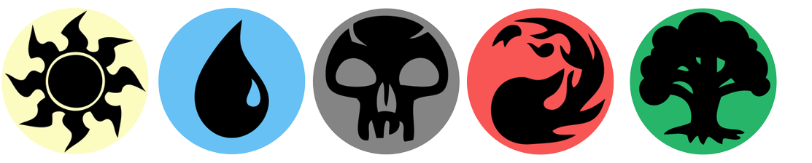

# organograma-v2

## Porque esse app foi desenvolvido:

Este projeto foi desenvolvido para organizar o pessoal que quer jogar Mtg (Magic The Gathering), assim podemos conhecer melhor os participantes.

- Quais os cares preferidas de cada um;
- A quanto tempo está jogando Magic The Gathering;
- O nome 
- E a foto para identificarmos uns aos outros

As cores de MTG, são várias, de acordo com a escolha de terrenos básicos que cada jogador escolheu.

Cada jogador pode estar em mais de um time, porque ele pode ter mais do que um Deck.

As cores principais para os terrenos são:

- Azul
- Branco
- Verde
- Vermelho
- Preto

Mas também temos outros terrenos ou combinações como por exemplo o Incolor e muitas outras combinações conhecidas.

Se quiser saber mais sobre MTG visite o site oficial: [https://magic.wizards.com](https://magic.wizards.com)

## Que tecnologias usamos:

- React
- JavaScript
- HTML
- CSS

### Este Projeto é a evolução do Organograma feito em React com Javascript

